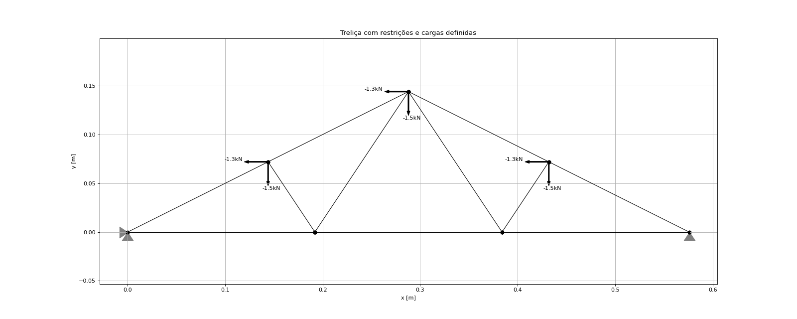
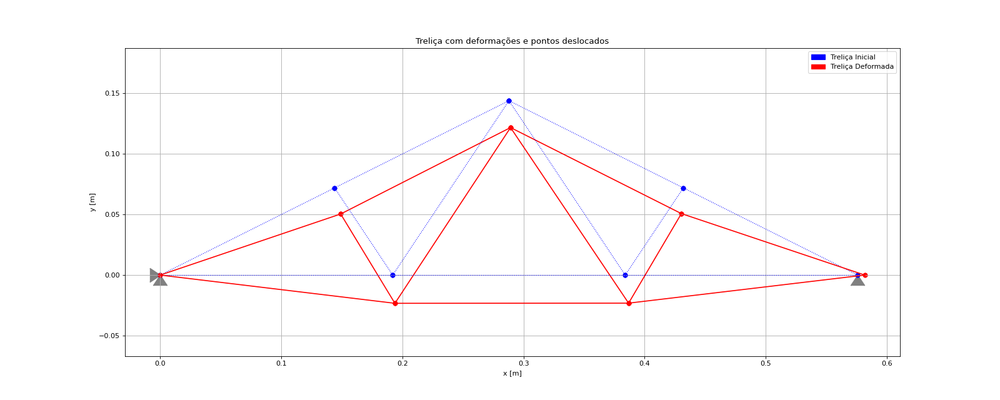
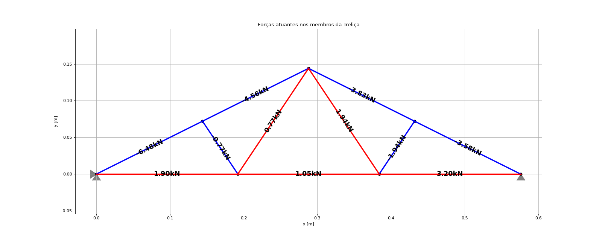

# Plain Trusser Solver

## Our Team:

<table>
  <tr>
    <td align="center"><a href="https://github.com/matheus-1618"> <b>Matheus Oliveira</b></a>  Developer</td>
   <td align="center"><a href="https://github.com/niveaabreu"> <b>Nívea de Abreu</b></a> Developer</td>
   <td align="center"><a href="https://github.com/gianvr"> <b>Giancalo Vanoni</b></a>  Developer</td>
  </tr>
</table>

Project of software with the goal to solve Plain Trusser due its entries.
To understand better the I/O files, look at the files inside the src folder.

## Results:

   <tr>
    <td align="center">  </td>
    <td align="center">  </td>
    <td align="center">  </td>
  </tr>

